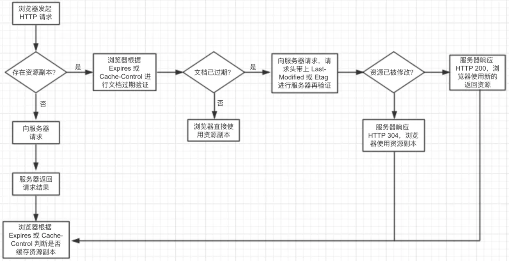

## Q: http 缓存逻辑是怎样的？协商缓存与强缓存？Last-Modified / Etag / Expires / Cache-Control ?

## A：

## HTML Meta 标签控制

`<meta http-equiv="Pragma" content="no-cache">`

仅有部分浏览器支持，故没有广泛使用

## HTTP 头部信息

### 强缓存(缓存期间不需要请求)

#### `Expires`(HTTP/1.0)

```
  Expires: Wed, 22 Oct 2018 08:41:00 GMT
```

表示资源会在`Web, 22 Oct 2018 08:41:00 GMT`后过期。

受限于本地时间，如果修改了本地时间，可能会造成缓存失效。

<br>

#### `Caceh-Control`(HTTP/1.1)

```
  Cache-Control: max-age=30 (表示资源会在 30 秒后过期)
```
Cache-Control的取值如下：

- public：所有内容都将被缓存（客户端和代理服务器都可缓存）
- private：内容只缓存到私有缓存中（仅客户端可以缓存，代理服务器不可缓存）
- no-cache：必须先与服务器确认返回的响应是否被更改，然后才能使用该响应来满足后续对同一个网址的请求。因此，如果存在合适的验证令牌（ETag），no-cache 会发起往返通信来验证缓存的响应，如果资源未被更改，可以避免下载
- no-store：所有内容都不会被缓存或 Internet 临时文件中
must-revalidation/proxy-revalidation：如果缓存的内容失效，请求必须发送到服务器/代理以进行重新验证
- max-age=xxx：缓存的内容将在 xxx 秒后失效

**no-cache 的作用是指跳过文档过期的验证而直接进行服务器再验证，而 no-store 是指资源禁止被缓存。**

**优先级高于 Expires。**

### 协商缓存

如果强缓存过期，那么使用协商缓存来解决。协商缓存需要请求，若有效则会返回 304.

协商缓存需要客户端和服务端共同实现。

#### `Last-Modified`和`If-Modified-Since`

`Last-Modified`表示本地文件最后修改日期。

`If-Modified-Since`会将`Last-Modified`的值发送给服务器，询问服务器在该日期后资源是否有更新，如果有更新会把新资源返回。

#### `ETag`和`If-None-Match`

`Etag`类似于文件指纹，`If-None-Match`会将当前`ETag`发送给服务器，询问该资源`ETag`是否变动，有变动则将新资源返回。

`ETag`优先级高于`Last-Modified`

### 选择合适的缓存策略

对于大部分的场景都可以使用强缓存配合协商缓存解决，但是在一些特殊的地方可能需要选择特殊的缓存策略

- 对于某些不需要缓存的资源，可以使用 `Cache-control: no-store` ，表示该资源不需要缓存
- 对于频繁变动的资源，可以使用 `Cache-Control: no-cache` 并配合 `ETag` 使用，表示该资源已被缓存，但是每次都会发送请求询问资源是否更新。
- 对于代码文件来说，通常使用 `Cache-Control: max-age=31536000` 并配合策略缓存使用，然后对文件进行指纹处理，一旦文件名变动就会立刻下载新的文件。


## 参考资料


[浏览器缓存机制介绍-掘金](https://juejin.im/post/59c602276fb9a00a3d135f2e)

[InterviewMap-缓存](https://yuchengkai.cn/docs/zh/frontend/performance.html#%E7%BC%93%E5%AD%98)