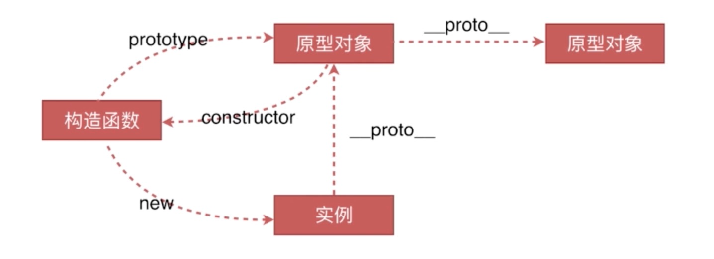

## 创建对象的几种方法

```
字面量对象
var o1 = {name: "o1"}
var o11 = new Object({name: "o11"})
```
```
显示的构造函数
var M = function(){
    this.name = "o2"
}
var o2 = new M();
```
```
var P = {name: "o3"}
var o3 = Object.create(P)
```

## 原型链


## instanceof原理
instanceof判断的其实是实例对象下__proto__与构造函数(M)下的prototype是不是同一个地址
```
function M(name){
    this.name = name
}
var o3 = new M('ace') 

// 需要注意的点
o3 instanceof M => true
o3 instanceof Object => true // 这里也是true
o3 instanceof Function => false
 
// 这里之所以也是true,是因为Object也存在于实例对象o3的原型链上,Object也会被认为是o3的构造函数
o3.__protp__ -> M.prototype
M.prototype包含constructor 和 __proto__
M.prototype.__proto__ -> Object.prototype

// 但Function是M.__proto__所指向的,不在o3的原型链上,所以为false
// 此处M是Function的实例, 所以M.__proto__会单独延伸出一条链 
// 所以在使用instanceof判断时会不准确, 一般使用constructor判断时最准备的

o3.__proto__.constructor === M // true
o3.__proto__.constructor === Object // false
```

## new运算符的原理
`new foo() 时发生了什么`
* 创建一个空对象,它将继承自foo.prototype `Object.create(foo.prototype).__proto__ === foo.prototype`
* 构造函数foo被执行,执行的时候,传入相应的参数,同时上下文会被指定为这个新实例,new foo 等同于 new foo() 只能在不传递任何参数时才可调用
* 如果构造函数返回了一个`对象`,那么这个对象会取代整个new出来的结果
* 如果构造函数没有返回对象, 那么new出来的结果为初始对象

```
// 模拟一个new运算符的实现
var new2 = function(fun){
    var o = Object.create(fun.prototype) 
    var k = fun.call(o) // 将上下文绑定至新对象
    
    if (typeof k === 'object'){ // 如果执行结果为一个对象,则舍弃o
        return k
    } else {
        return o
    }
}

// 这里之所以用Object.create创建对象,是因为这个方法是将参数当做新对象的原型对象赋给它的
// 我们可以看一下第三种创建对象的方式

var P = {name: "o3"}
var o3 = Object.create(P)
console.log(o3) // Object {}
console.log(o3.__proto__) // {name: "o3"}
此时结果为一个空对象,并没有name属性,他只能通过o3.__proto__去获取name属性
```


